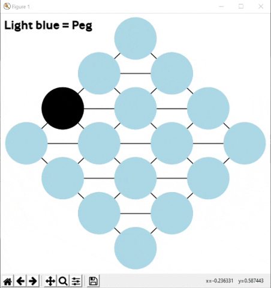
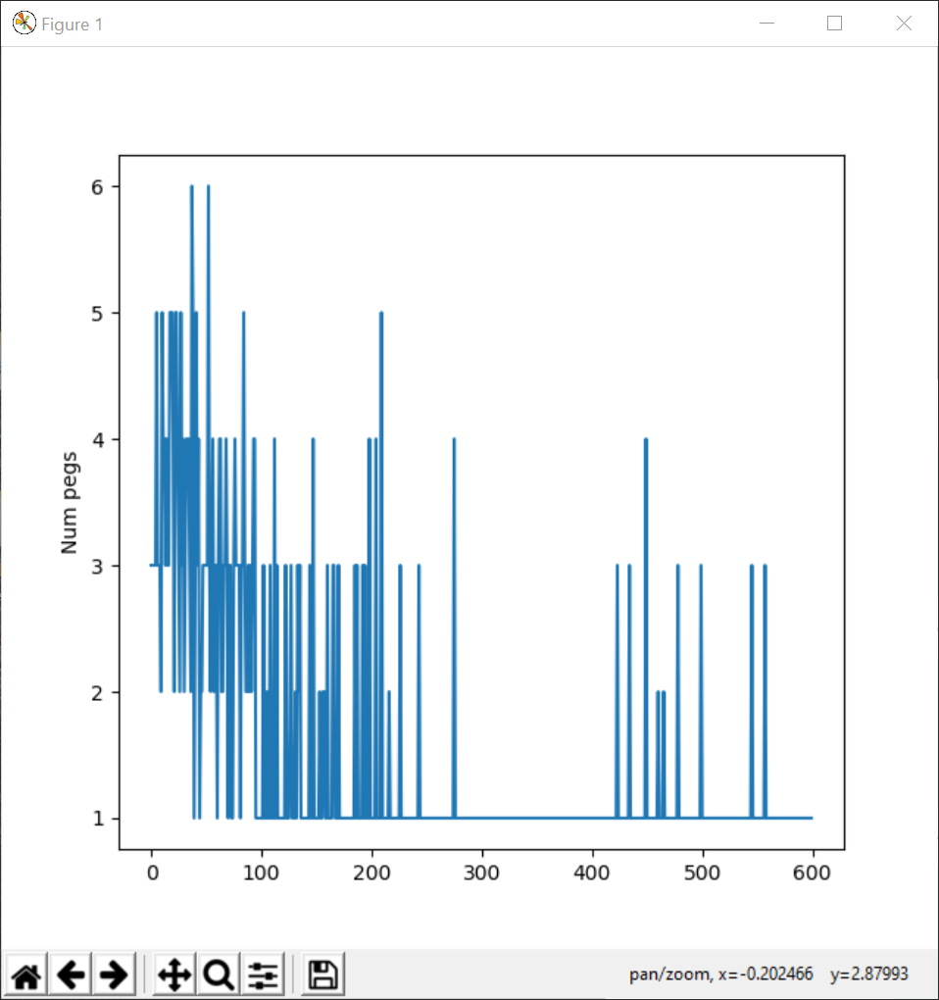
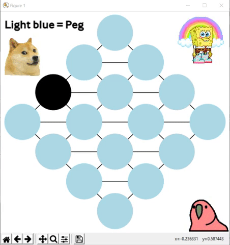

# Peg-solitaire-reinforcement-learning
Implementation of peg solitare and the Actor-Critic algorithm to solve the game as shown below.
The game board can be a diamond or a triangle of arbitrary size, specified in the parameters.json
Requirements are matplotlib and networkx, simply run main.py

After 600 episodes (training sessions) the algorithm solves the game flawlessly:

The number of pegs on the board converges to 1 (win):

Meme-version for faster speeds:

